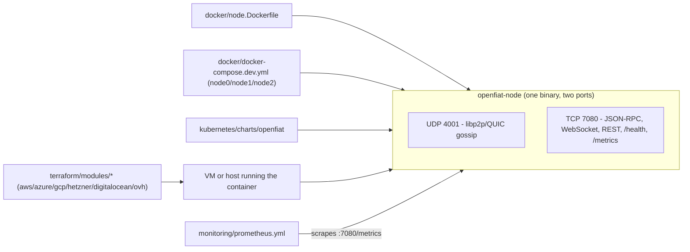

# Architecture — openfiat-infra

This repository packages deployment surface for one real binary,
`openfiat-node` (built in [openfiat-core](https://github.com/OpenFiat-org/openfiat-core)),
plus the observability stack that watches it. It does not contain any
protocol logic itself.

## Components

- **`docker/node.Dockerfile`** — multi-stage Rust build of `openfiat-node`.
  `EXPOSE`s exactly the two real ports above; its own `HEALTHCHECK` hits
  `GET /health`. Build context must be an `openfiat-core` checkout.
- **`docker/web.Dockerfile`** — generic multi-stage build for any Next.js
  app selected by the `APP_DIR` build arg, currently pointed at
  `openfiat-apps`.
- **`docker/docker-compose.dev.yml`** — a real, persistent 3-node local
  devnet cluster (`node0`/`node1`/`node2`); see `docker/README.md` for the
  full walkthrough.
- **`kubernetes/charts/openfiat`** — a Helm chart deploying `openfiat-node`
  with the same two ports, an optional Ingress fronting the HTTP port, and
  an HPA.
- **`terraform/modules/<provider>`** — six provider modules (aws, azure,
  gcp, hetzner, digitalocean, ovh) sharing one variable surface
  (`node_count`, `instance_size`, `tags`, plus a provider-specific region
  variable). Currently variables/outputs only — resource blocks are
  commented scaffolding until target account details are supplied; see
  `terraform/README.md`.
- **`monitoring/`** — Prometheus, Grafana, Loki, Tempo, Alertmanager, and
  an OTel Collector. Prometheus scrapes `openfiat-node`'s own `/metrics`
  on its one HTTP port — there is no separate metrics port to configure.

## What `openfiat-node` actually exposes

Two ports, both real (`crates/cli`'s `CLI_LISTEN_ADDR`/`CLI_HTTP_ADDR`
defaults in `openfiat-core`):

| Port | Protocol | Carries |
|---|---|---|
| 4001 | UDP | libp2p/QUIC gossip (peer-to-peer) |
| 7080 | TCP | JSON-RPC (`POST /rpc`), WebSocket (`GET /ws`), REST, `GET /health`, `GET /metrics` |

There is no separate metrics or RPC port — every HTTP surface is one axum
router. Config is entirely `CLI_*` environment variables (no config file,
no CLI flags); see `openfiat-core`'s own `docs/getting-started.md` for the
full list.
